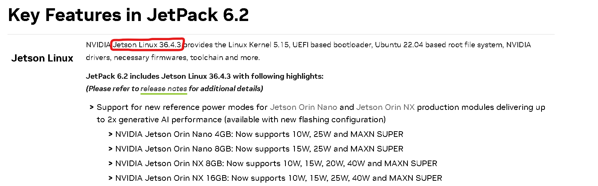
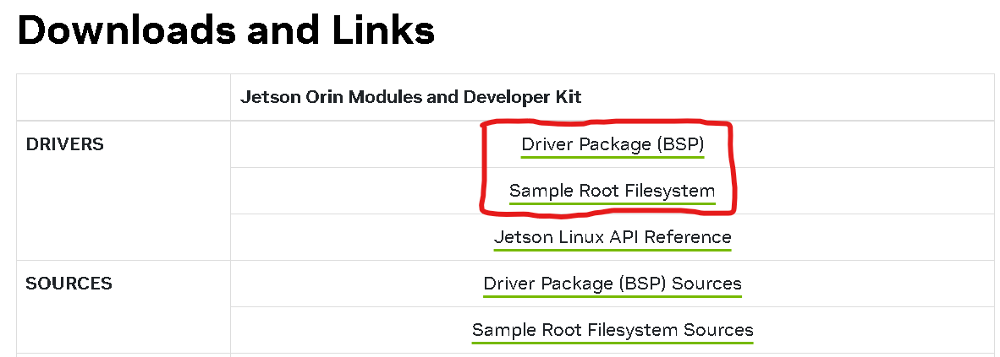
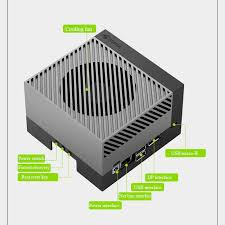
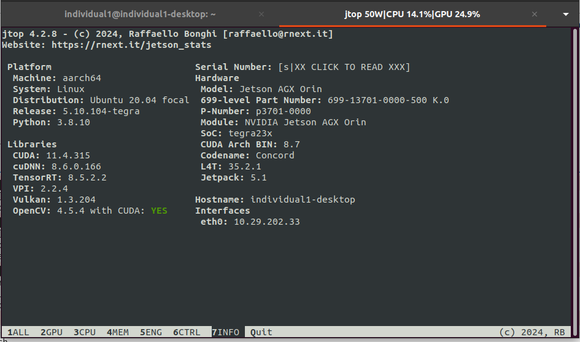

# YOLO-V3-Model-For-Defecting-Detection-On-Beverage-Package-Using-NVIDIA-Jetson-AGX-ORIN

Hello Everyone, On this Repo We are going to know how to integrate and use a Jetson for Implementing AI model. Jetson one of the best mini computer that can be a core of robotics. YoloV3 is one of the best yolo version, solid model and cheap model (not really need high computation).

Before we jump to integrate. We should comprehend what kind of library that we want to use and integrate. In this case im going to use a several fundamental library such as :
1. Pytorch (Fundamental)
2. TorchVision (To manipulate image to tensor)
3. OpenCV (Deploying in realtime)
4. PIL (Preprocess Image/Video)

After you know whole library you need lets jump to installing Jetson Package (jetpack)  and flashing jetson depend on your model need. There 2 condition before we installing jetpack and flashing our jetson :
1. You should have a host PC that use the same OS with Jetson Operation Systemn (ubuntu LTS)
2. The ubuntu version should match with jetpack you gonna install

After 2 condition filled we can start to installing and flashing our jetson :
## *STEP 1*
- [You can visit this link to see what jetpack are available on your Jetson Series](https://developer.nvidia.com/embedded/jetpack-archive)

- after we know what jetpack we want to use jetson linux 36.0 (Depend on your jetpack version)

- Download 2 marked file bellow :

## *STEP 2*
Im going to tell you that flashing is like deleting or formating our system and fill with a new version one. So we have to run a bunch of instruction to do it. But before it we should make connect the Host PC to the Jetson and then make a jetson in factory mode. By press the middle button (Jetson AGX Orin series).

On the host PC run this syntax :
- *$ sudo tar xf ${L4T_RELEASE_PACKAGE}*
  
This command is used to extract the Linux for Tegra package, which is originally in a tar format, in order to create the environment. The detailed explanation is as follows:

- *$ cd Linux_for_Tegra/rootfs/*
  
This command is used to access the Linux for Tegra environment and navigate to the root file system directory. The detailed explanation is as follows:

- *$ sudo tar xpf ../../${SAMPLE_FS_PACKAGE}*
  
This command is used to extract the Root File System package (Depend On Your File Name).

- *$ cd ..*
  
This command is used to move to the parent directory, which in this case is Linux_for_Tegra.

- *$ sudo ./apply_binaries.sh*
  
This command is used to apply binary files contained in Linux for Tegra. It enables interaction with essential Jetson components such as the GPU.

- *$ sudo ./flash.sh ${Board} mmcblk0p1*
  
This command is used to start the flashing process. A more detailed explanation is as follows:

flash.sh : The script that executes the flashing process.

${Board} : The type of Jetson board being used. For example, if using Jetson AGX Orin, this should be filled with jetson-agx-orin.

mmcblk0p1 : The target device address of the Jetson connected to the host machine.

## **Step 3**
After completing the flashing process, the next step is to set up the proper environment for using the PyTorch library. Run these syntax to make it through :
- *$ sudo pip3 install -U jetson-stats*

Installing JTOP – a software tool used to monitor and navigate GPU and CPU usage. At this stage, several essential components should already be installed, such as CUDA, cuDNN, TensorRT, and Vulkan.

- *$ sudo apt install cuda-toolkit-12-2*
- *$ sudo apt install libcudnn8*
- *$ sudo apt install nvidia-tensorrt*
- *$ sudo apt install nvidia-vpi $ sudo apt install nvidia-vpi-dev*
- *$ sudo apt-get install libopencv-dev libopencv-core-dev libopencv-highgui-dev \
libopencv-features2d-dev libopencv-calib3d-dev libopencv-imgproc-dev \
libopencv-video-dev libopencv-objdetect-dev libopencv-contrib-dev \
libopencv-imgcodecs-dev libopencv-shape-dev libopencv-stitching-dev \
libopencv-superres-dev libopencv-videostab-dev libopencv-viz-dev*
- Next, adjust the PyTorch wheel version to match the installed versions of CUDA, cuDNN, and TensorRT. This ensures that PyTorch integrates correctly with the available hardware components, especially the GPU.
- The next component is torchvision, and make sure that the version installed is compatible with the versions of CUDA, cuDNN, and TensorRT.
- After all components are installed, the JTOP info panel will display information similar to what is shown bellow :

[You Can See The Documentation Of Pytorch/Torchvision That match to your jetpack on:](https://forums.developer.nvidia.com/t/pytorch-for-jetson/72048)

